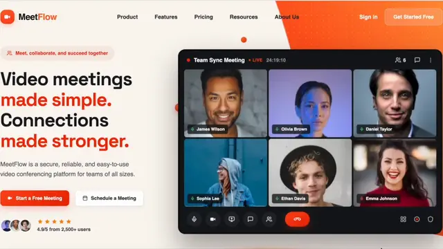
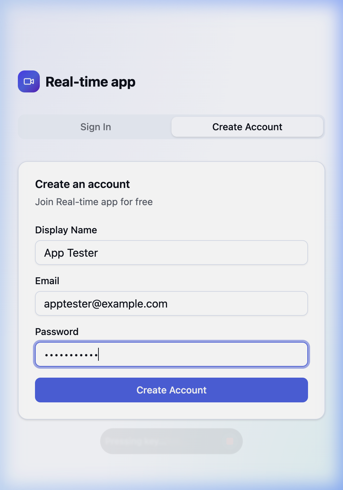
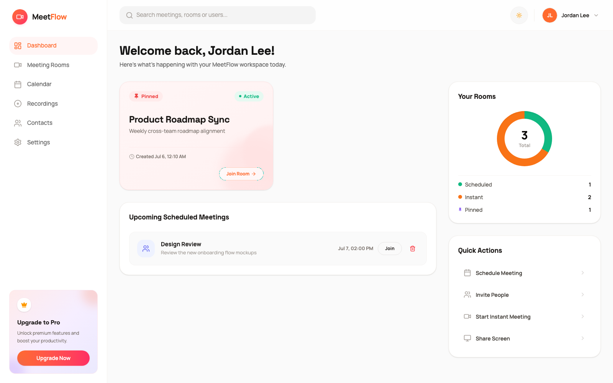
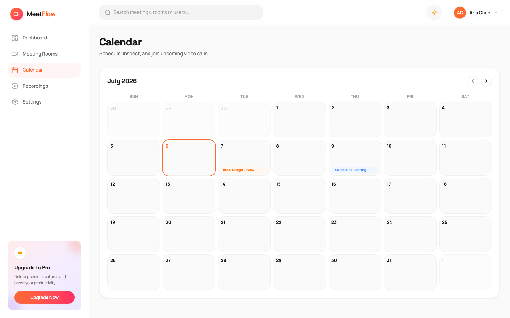
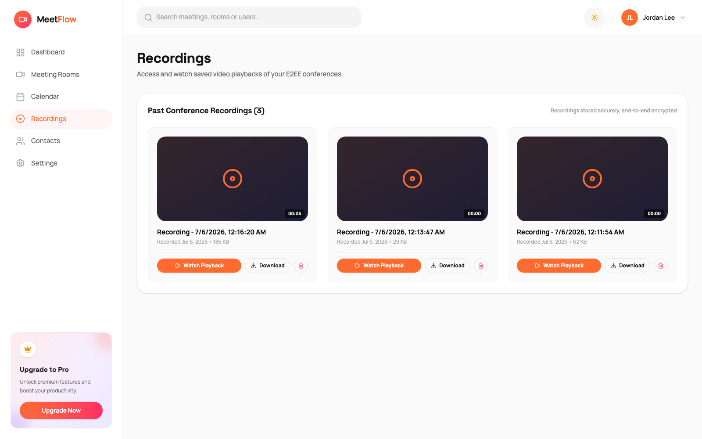
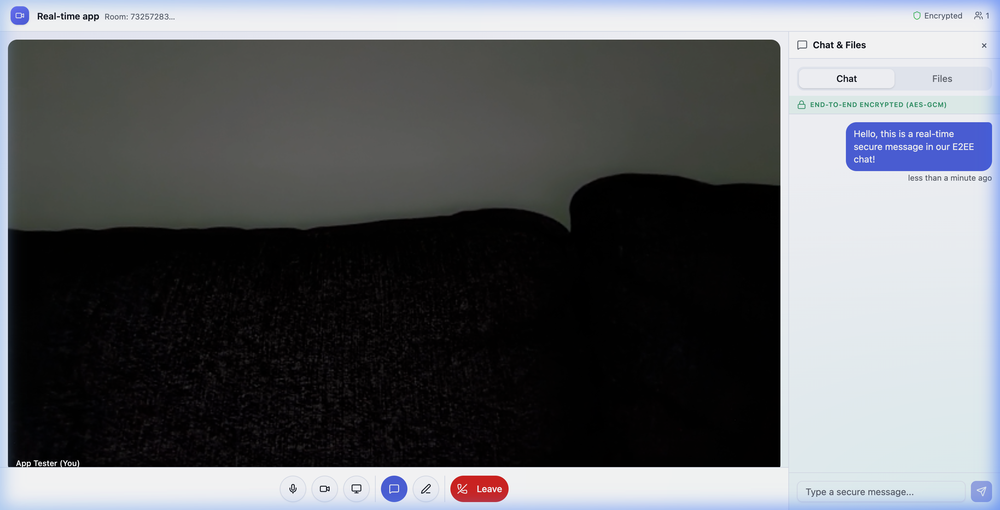
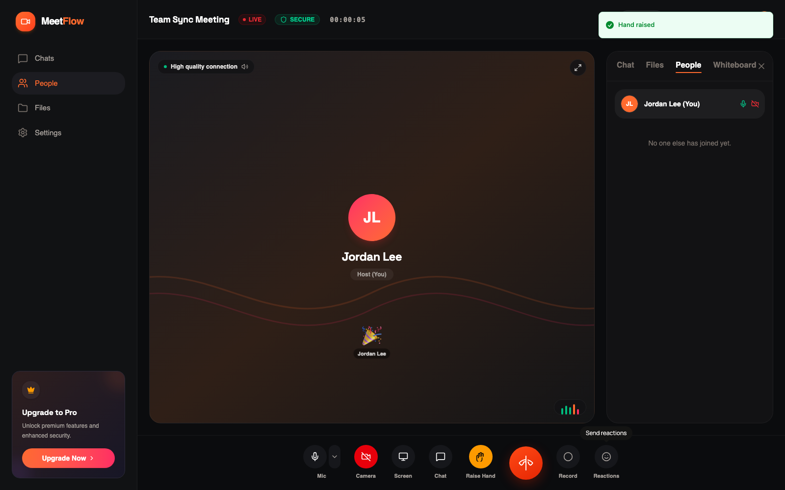
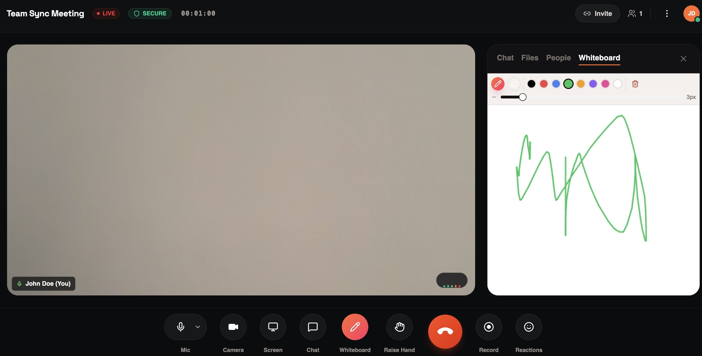

# MeetFlow - Real-Time Video Conferencing & Collaboration Tool

MeetFlow app is a secure, real-time video calling and collaboration platform built with React, Django Channels (WebSockets), and WebRTC. It supports multi-user video calling, screen sharing, a shared real-time whiteboard, and end-to-end encrypted (E2EE) messaging and file sharing.

**🔗 Live Demo:** [codealpha-tasks-real-time-communication.onrender.com](https://codealpha-tasks-real-time-communication.onrender.com/)

> [!NOTE]
> The live application is hosted on Render's **free tier**. If the site has not been accessed recently, the server will go to sleep. The initial page load may take up to **50 seconds** (cold start) while the container spins back up.
---

## 🚀 Key Features

* **Multi-User Video Calling:** HD audio/video streaming powered by WebRTC mesh architecture.
* **Screen Sharing:** Instant screen sharing directly integrated into WebRTC peer tracks.
* **End-to-End Encrypted Chat:** Private text chat secured client-side via **AES-GCM (256-bit)**. Keys are derived dynamically using the Web Crypto API based on the Room ID, ensuring the server only sees encrypted ciphertexts.
* **Secure File Sharing:** Files are encrypted client-side before upload, stored securely on the backend, and decrypted dynamically upon download by valid room participants.
* **Video Meeting & Call Recording:** Records video meetings and audio calls client-side by compositing the video grid onto a canvas and mixing every participant's audio, then encrypts the result with the same AES-GCM room key before upload — playback decrypts it again on demand from the Recordings tab.
* **Calendar & Scheduled Meetings:** Schedule meetings for a real date/time; they appear on a real calendar grid and as a room you can join early or cancel.
* **Pinnable Dashboard Rooms:** Pin any room to feature it on the dashboard as a live-status card — pin as many as you like, with real per-user room statistics (scheduled / instant / pinned).
* **In-Call Reactions & Raise Hand:** Emoji reactions and hand-raise state are broadcast to every participant in real time over the room's WebSocket channel.
* **Live Synchronized Whiteboard:** A multiplayer canvas enabling collaborative drawing and writing synchronized in real-time via WebSockets.
* **Secure Authentication:** User sign-up and log-in powered by Django REST Framework Token Authentication.

---

## 📸 Demo & Screenshots

### Application Walkthrough (WebP Demo)



### Screenshots

| Sign In / Sign Up | Dashboard (pinned rooms + real stats) |
|---|---|
|  |  |

| Calendar (real scheduled meetings) | Recordings (encrypted playback) |
|---|---|
|  |  |

| Room (End-to-End Encrypted) | In-Call Reactions & Raise Hand |
|---|---|
|  |  |

| Live Collaborative Whiteboard (Multiplayer canvas for real-time drawing and brainstorming) |
|---|
|  |

---

## 💡 Future Features & Ideas

Here are some potential features and improvements that can be implemented for this project:

* **Breakout Rooms:** Allow meeting hosts to split participants into smaller sub-rooms for focused discussion groups.
* **Advanced Whiteboard Tools:** Add shapes, text boxes, image insertion, and template exporting to the whiteboard canvas.
* **Virtual Backgrounds & Blur:** Enable client-side background blur or virtual image replacement using TensorFlow.js body segmentation.
* **Screen Sharing Annotations:** Allow participants to draw directly over a shared screen stream.
* **AI-Powered Call Transcription:** Auto-generate encrypted meeting transcripts and summaries.
* **Contact Us Inquiries & Newsletters:** Integrate an email service (like SendGrid or Mailgun) to process user messages sent via the *Contact Us* page and manage marketing or announcement newsletter subscriptions.

---

## 🛠️ Technology Stack

### Frontend
* **Core:** React 19, TypeScript, Vite
* **Styling:** Vanilla CSS & Tailwind CSS v4, Lucide Icons
* **UI Components:** Radix UI primitives & Shadcn UI design patterns
* **Security:** Web Crypto API (SubtleCrypto) for AES-GCM encryption/decryption

### Backend
* **Core:** Django 4.2, Python 3.9
* **API Engine:** Django REST Framework (DRF)
* **Real-time Server:** Django Channels (ASGI routing)
* **ASGI Server:** Daphne
* **Database:** SQLite (Development) / PostgreSQL via Neon (Production)
* **Static Assets:** WhiteNoise (configured for Monolithic Docker deployment)

---

## 💻 Local Development Setup

To run this project locally, you will need to start both the React frontend and the Django backend.

### Backend Setup

1. Navigate to the `backend` directory:
   ```bash
   cd backend
   ```
2. Create and activate a Python virtual environment:
   ```bash
   python3 -m venv venv
   source venv/bin/activate
   ```
3. Install dependencies:
   ```bash
   pip install -r requirements.txt
   ```
4. Run migrations to initialize the SQLite database:
   ```bash
   python manage.py migrate
   ```
5. Start the backend development server using Daphne (to support WebSockets):
   ```bash
   daphne -b 127.0.0.1 -p 8000 backend.asgi:application
   ```

### Frontend Setup

1. Navigate back to the project root directory.
2. Install npm dependencies:
   ```bash
   npm install
   ```
3. Start the Vite development server:
   ```bash
   npm run dev
   ```
4. Open your browser and navigate to `http://localhost:5173/`.

---

## ✅ Testing

### Backend (Django)
79 tests covering models, serializers, REST views, and the WebSocket consumer (auth handshake, chat persistence, signalling relay) — including the Recording and ScheduledMeeting models/endpoints, the Contacts directory endpoint, and pinning a room.

```bash
cd backend
source venv/bin/activate
python manage.py test
```

### Frontend (Vitest)
35 unit tests covering the AES-GCM encryption helpers (`src/lib/crypto.ts`), the API client (`src/lib/api.ts` — including the meetings/recordings/contacts/pin endpoints), utility functions (`src/lib/utils.ts`), and the call-recorder's browser-support detection (`src/hooks/use-call-recorder.ts`).

```bash
npm run test        # single run
npm run test:watch  # watch mode
```

---

## 🐳 Docker & Production Deployment (Render)

This project is optimized to run as a **monolith Docker container**. It builds the React frontend, places it inside Django, runs Django's `collectstatic` command, and serves both static files and ASGI WebSockets using a single container.

### Step 1: Render Setup

1. Create a free **PostgreSQL Database** on [Neon.tech](https://neon.tech/) and copy the connection string.
2. Create a new **Web Service** on Render pointing to your Git repository.
3. Choose the **Docker** runtime. (Render will automatically detect the root `Dockerfile`).

### Step 2: Environment Variables
Add the following variables to your Render Web Service environment configurations:

* `DATABASE_URL`: `postgresql://your-neon-db-url`
* `DJANGO_SETTINGS_MODULE`: `backend.settings`
* `VITE_API_URL`: `/api`
* `VITE_WS_URL`: `wss://your-render-app-name.onrender.com/ws`

During the build process, the multi-stage Docker setup will build the React files with the correct production URL prefixes and package them into Python's static distribution system.
